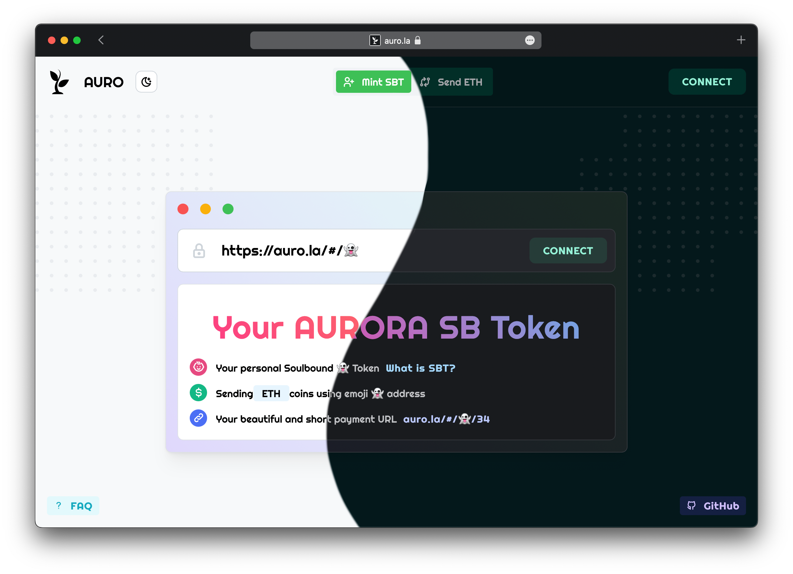
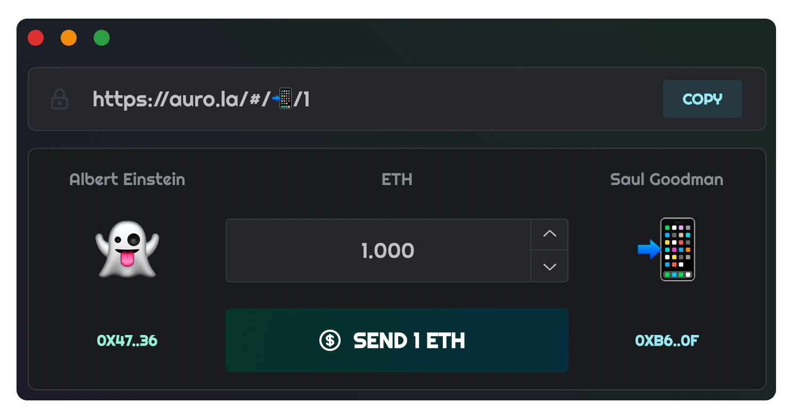

# auro.la - Soulbound 👻 Token



SBT is like NFT, but more interesting.

#### **AURO SBT** is something unique that will belong to only one address.

This is a finite number of tokens, since there are approximately **1411 emoji** in total (excluding skin tone).


- Your personal Soulbound 👻 Token
- Sending ETH coins using emoji 👻 address
- Your beautiful and short payment URL



#### Created interfaces on Solidity to help other users create their own Soulbound 👻 Token.

##### Installation Soulbound Contracts

```
$ npm install @auroralabs/contracts
```

##### Usage Soulbound Contracts

- Contract

```solidity
import "@auroralabs/contracts/SBT.sol";
```

- Interface

```solidity
import "@auroralabs/contracts/interfaces/ISBT.sol";
```

#### Links:

- <a href="https://auro.la">AURO.LA App</a>
- <a href="https://github.com/auro-la/auro-la.github.io">GitHub App</a>
- <a href="https://github.com/auro-la/contracts">GitHub Smart Contracts</a>
- <a href="https://www.npmjs.com/package/@auroralabs/contracts">NPM Smart Contracts</a>
